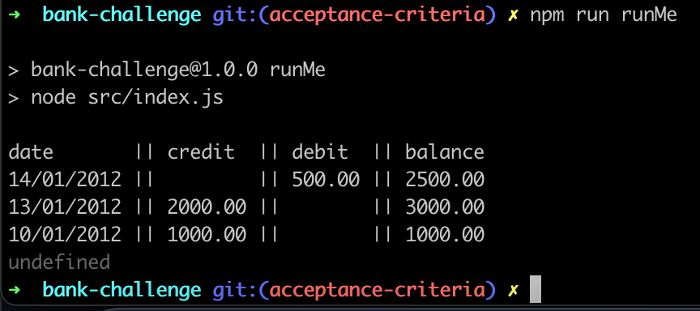

# Bank Challenge
This program allows the user to make deposits, withdrawals and print bank account statements. A bank statement includes a history of transactions and an updated ballance. Each transaction has a date, a transaction type (credit or debit) and an amount.

## Instructions

1. Fork this repository and then:
```sh
$ git clone https://github.com/<YOUR GITHUB USERNAME>/bank-challenge.git && cd bank-challenge
$ npm install # installs dependencies listed in package.json
```
2. Run the tests from your project root directory. You can run your test suite in a few ways:
```sh
$ npm test
# or run jasmine directly
$ ./node_modules/jasmine/bin/jasmine.js
```
3. To see the project in action run:
```sh
$ npm run runMe
```
4. To lint you project run:
```sh
$ npm run lint
```

To fix linting issues run;
```sh
$ npm run lint:fix
```

## Specification

### Requirements

* Results of the code should display via the JavaScript console. 
* Deposits, withdrawal.
* Account statement (date, credit or debit amount, balance) printing.
* Data can be kept in memory (it doesn't need to be stored to a database or anything).

### Acceptance criteria

**Given** a client makes a deposit of 1000 on 10-01-2012  
**And** a deposit of 2000 on 13-01-2012  
**And** a withdrawal of 500 on 14-01-2012  
**When** she prints her bank statement  
**Then** she would see

```
date       || credit  || debit  || balance
14/01/2012 ||         || 500.00 || 2500.00
13/01/2012 || 2000.00 ||        || 3000.00
10/01/2012 || 1000.00 ||        || 1000.00
```
#### Standard
- [ ] Meets the spec
- [ ] Developed test-first
- [ ] Passes tests and code is clean and well formatted
- [ ] Encapsulates adding and storing Transactions in a class
- [ ] Encapsulates Statement formatting in a class
- [ ] Encapsulates Transaction data in a class

#### Extended
- [ ] Can you format the console output?  Credited values should be GREEN and debited values should be RED.  The balance should be GREEN if positive and RED if negative

You may find this link useful [Output to the command line using NodeJS](https://nodejs.dev/en/learn/output-to-the-command-line-using-nodejs/) - check the formatting section (and this links out to a GitHub doc on the [ANSI color codes](https://gist.github.com/iamnewton/8754917))

## User Stories

As a customer of the bank,
I want to be able make a deposit into my bank account,
So that I can keep money safe.

As a customer of the bank,
I want to be able to make a withdrawal from my bank account,
So that I can spend some of my money.

As a customer of the bank,
I want to see the date of each of my account transactions,
So that I can see the history of my transactions.

As a customer of the bank,
I want to know the current balance of my bank account,
So that I can take informed decisions regarding my finances.

As a customer of the bank,
I want to be able print a bank statement in a reverse chronological order,
So that I can see my deposits, withdrawals and my current ballance at a certain date.


## Domain Models

### User Story 1

```
As a client of the bank,
I want to be able make a deposit into my bank account,
So that I can keep money safe.
```

| Objects     | Properties                | Messages                     | Output                                               |
| ----------- | --------------------------|------------------------------| -----------------------------------------------------|
| Account     |  accountUpdate@Array[]    | getAccountUpdate()           | @Array[{transaction: @Transaction, balance: @Number}]|
|             |  transaction @Transaction | newTransaction(@Transaction) | @Error                                               |
|             |                           |                              | @Void                                                |
|             |                           | deposit()                    | @Void                                                |
|             |                           |                              |                                                      |
| Transaction |  amount @Number           | getAmount()                  | @Number                                              |
|             |  transactionType @TxnType | getType()                    | @TxnType                                             |
|             |                           |                              |                                                      |
| TxnType     |  credit @String           |                              |                                                      |

#### Tests
1. Test that the account has an empty accountUpdate array when first instantiated.
2. Test that a populated accountUpdate array returns the length of the number of transactions made on the account.
3. Test that adding 1 transaction to the account when called with newTransaction actually adds a transaction of type `credit`.
4. Test that the account throws an error if the transaction type not a string.
4. Test that the account throws an error if the transaction amount not a number.
4. Test that the account throws an error if the transaction amount a negative number.
5. Test that the account calls getType on the transaction object when newTransaction is called on the account.
6. Test that the account calls getAmount on the transaction object when newTransaction is called on the account.

### User Story 2

As client of the bank,
I want to be able to make a withdrawal from my bank account,
So that I can spend some of my money.

| Objects     | Properties                | Messages                     | Output                                               |
| ----------- | --------------------------|------------------------------| -----------------------------------------------------|
| Account     |  accountUpdate@Array[]    | getAccountUpdate()           | @Array[{transaction: @Transaction, balance: @Number}]|
|             |  transaction @Transaction | newTransaction(@Transaction) | @Error                                               |
|             |                           |                              | @Void                                                |
|             |                           | withdrawal()                 | @Void                                                |
|             |                           |                              |                                                      |
| Transaction |  amount @Number           | getAmount()                  | @Number                                              |
|             |  transactionType @TxnType | getType()                    | @TxnType                                             |
|             |                           |                              |                                                      |
| TxnType     |  debit @String            |                              |                                                      |

#### Tests
1. Test that adding 1 transaction to the account when called with newTransaction actually adds a transaction of type `debit`.

### User Story 3
As client of the bank,
I want to see the date of each of my account transactions,
So that I can see the history of my transactions.

| Objects     | Properties                | Messages                     | Output                                               |
| ----------- | --------------------------|------------------------------| -----------------------------------------------------|
| Transaction |  amount @Number           | getAmount()                  | @Number                                              |
|             |  transactionType @TxnType | getType()                    | @TxnType                                             |
|             |  date @Date               | getDate()                    | @Date                                                |

#### Tests

### User Story 4

As client of the bank,
I want to know the current balance of my bank account,
So that I can take informed decisions regarding my finances.


| Objects     | Properties                | Messages                     | Output                                               |
| ----------- | --------------------------|------------------------------| -----------------------------------------------------|
| Account     |  accountUpdate@Array[]    | getAccountUpdate()           | @Array[{transaction: @Transaction, balance: @Number}]|
|             |  balance @Number          | getBalance()                 | @Number                                              |
|             |  transaction @Transaction | newTransaction(@Transaction) | @Error                                               |
|             |                           |                              | @Void                                                |
|             |                           | deposit()                    | @Void                                                |
|             |                           | withdrawal()                 | @Void                                                |
|             |                           |                              |                                                      |
| Transaction |  amount @Number           | getAmount()                  | @Number                                              |
|             |  transactionType @TxnType | getType()                    | @TxnType                                             |
|             |  date @Date               | getDate()                    | @Date                                                |
|             |                           |                              |                                                      |
| TxnType     |  credit @String           |                              |                                                      |
|             |  debit @String            |                              |                                                      |


#### Tests
1. Test that the account updates the balance to 1000 after a transaction of type credit and amount 1000 is added to the account.
2. Test that the account updates the balance to 3000 after two transactions of type credit and amounts 1000, and respectively 2000 are added to the account.
3. Test that the account updates the balance to 2500 after adding three transactions of type `credit, credit and debit` and amounts 1000, 2000 and 500.
4. Test that newTransaction called on the account adds the latest transaction at the start of the accountUpdate array.

### User Story 5
As client of the bank,
I want to be able print a bank statement,
So that I can see my deposits, withdrawals and my current ballance at a certain date.
  
| Objects        | Properties                | Messages                               | Output                                               |
| -----------    | --------------------------|----------------------------------------| -----------------------------------------------------|
| Account        |  accountUpdate@Array[]    | getAccountUpdate()                     | @Array[{transaction: @Transaction, balance: @Number}]|
|                |  balance @Number          | getBalance()                           | @Number                                              |
|                |  transaction @Transaction | newTransaction(@Transaction)           | @Error                                               |
|                |                           |                                        | @Void                                                |
|                |                           | deposit()                              | @Void                                                |
|                |                           | withdrawal()                           | @Void                                                |
|                |                           |                                        |                                                      |
| Transaction    |  amount @Number           | getAmount()                            | @Number                                              |
|                |  transactionType @TxnType | getType()                              | @TxnType                                             |
|                |  date @Date               | getDate()                              | @Date                                                |
|                |                           |                                        |                                                      |
| TxnType        |  credit @String           |                                        |                                                      |
|                |  debit @String            |                                        |                                                      |
|                |                           |                                        |                                                      |
| PrintStatement | headerRow @String         | printHeaderRow()                       | @String                                              |
|                |                           | printTransactionsRows (@Array)         | @Void                                                |
|                |                           | createBankStatementRowsArray (@Array)  | @Array                                               |
|                |                           | statementRowsStringsArray(@Array)      | @Array                                               |
|                |                           | statementRowString (@Transaction)      | @String                                              |
|                |                           | formatDate (@Transaction)              | @String                                              |
|                |                           | formatDateColumn(@Transaction)         | @String                                              |
|                |                           | formatAmount(amount @Number)           | @String                                              |
|                |                           | formatTransactionAmount (@Transaction) | @String                                              |
|                |                           | formatDebitColumn (@Transaction)       | @String                                              |
|                |                           | formatCreditColumn (@Transaction)      | @String                                              |

#### Tests
1. Test that calling formatDate on PrintStatement formats the transaction date to dd/mm/yyyy format.
2. Test that calling formatDateColumn on PrintStatement formats the transaction date column to `dd/mm/yyyy || `.
3. Test that calling formatCreditColumn on PrintStatement formats the transaction credit column to a string.
4. Test that calling formatDebitColumn on PrintStatement formats the transaction debit column to a string.
5. Test that calling formatAmount on PrintStatement formats the transaction amount to a number with two decimal places and returns it as a string.
6. Test that calling statementRowString on PrintStatement formats the transaction row with a date, and credit or debit formatted amount.
7. Test that calling createBankStatementRowsArray on PrintStatement creates an array of strings: a header and a transaction row with a date, credit, debit AND balance formatted amounts.
8. Test that PrintStatement logs a headerRow to the console if no transactions are made.
9. Test that PrintStatement logs as many rows to the console as the length of the accountUpdate array plus one for the headerRow.
10. Test that PrintStatement logs are called with the correct arguments: each of the objects in the accountUpdate array. 

### User Story 6

As client of the bank,
I want to be able print the history of my account transactions on the bank statement in descending order,
So that I can see the most recent transactions first.

#### Tests
- Test that the first transaction to be printed to the console is the most recent transaction.

## Running the program

To interact with the programme:

Go to the root of your project and run the command _npm run runMe_ or _cd src && node index.js_ in the console.

This is printed to the terminal:



